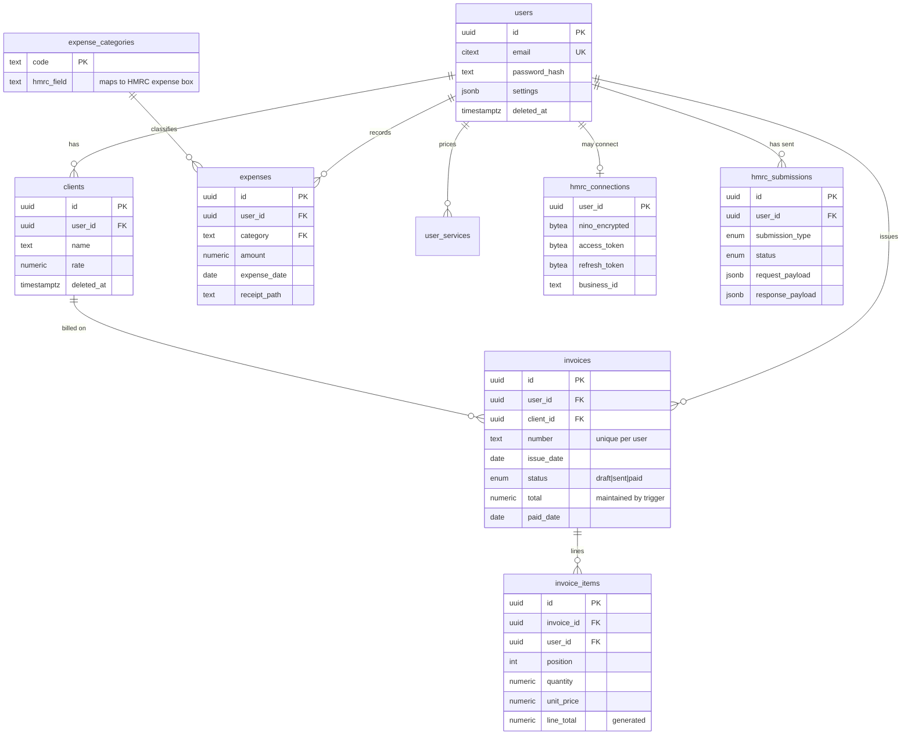

# The ASETS database

PostgreSQL 17 on Supabase (free tier). Schema `asets`, which is why it
coexists safely in a database shared with another project. Every statement the
application issues lives in [`backend/db/repo.py`](../backend/db/repo.py)
and [`backend/db/hmrc_repo.py`](../backend/db/hmrc_repo.py); the schema
itself is the numbered SQL in
[`backend/db/migrations/`](../backend/db/migrations/).

## Why PostgreSQL and not the document store it started on

This data is money owed, money spent, and figures that end up on a tax
return. Three properties matter more than flexibility:

- **Exact arithmetic.** Every amount is `NUMERIC(12,2)`; quantities are
  `NUMERIC(12,3)` so half-hours work. Floating point loses pennies, and
  pennies that reach HMRC are wrong.
- **Referential integrity.** An invoice line cannot exist without its
  invoice, an expense cannot carry a category nobody defined, and an
  invoice cannot point at a client that was never created.
- **Enforcement below the application.** Row-level security means a
  missing `WHERE user_id = …` returns nothing instead of another
  practitioner's books.

## Shape



## Decisions worth knowing about

**`invoices.total` is denormalised, and a trigger keeps it honest.**
Every dashboard read sums invoices; none of them wants to join line
items. `refresh_invoice_total()` recomputes the column on any insert,
update or delete of a line, so the number cannot drift no matter who
writes. `invoice_items.line_total` is a stored generated column —
`round(quantity * unit_price, 2)` — so the rounding happens once, in one
place.

**`invoice_items` carries `user_id` even though it could be reached
through its invoice.** Row-level security needs a tenant column on the
table it protects. A composite foreign key
`(invoice_id, user_id) → invoices(id, user_id)` makes it impossible for
the two to disagree.

**Soft deletes for books, hard deletes for accounts.** Clients, invoices
and expenses set `deleted_at`: an accountant may need to explain a gap
next year. Deleting an *account* is a real `DELETE` that cascades — the
privacy policy promises erasure, so erasure is what happens.

**Partial indexes match the queries.** Almost every read is "mine, not
deleted, newest first", so the indexes carry
`WHERE deleted_at IS NULL` rather than paying to index rows nothing
reads.

**Invoice numbers are allocated under an advisory lock.** Two devices
creating an invoice in the same instant would otherwise both compute
`INV-0007`. The lock serialises them; the unique index is the backstop.

## Tenant isolation

Tables under row-level security: `user_services`, `clients`, `invoices`,
`invoice_items`, `expenses`, `hmrc_connections`, `hmrc_submissions`.

Each policy is the same shape:

```sql
USING (user_id = asets.current_user_id())
WITH CHECK (user_id = asets.current_user_id())
```

`asets.current_user_id()` reads a transaction-local setting. The
application sets it once, at the start of every transaction, through
[`pool.tenant()`](../backend/db/pool.py):

```python
async with pool.tenant(user_id) as conn:
    rows = await conn.fetch("SELECT * FROM asets.invoices")
```

Consequences that are load-bearing:

- Forget the tenant scope and you get **zero rows**, not everyone's.
- `FORCE ROW LEVEL SECURITY` means the table owner is fenced too, so a
  mistake in a migration or a deploy role is not a data leak.
- The setting is transaction-local (`set_config(..., true)`), so it
  cannot leak between requests sharing a pooled connection. There is a
  test for exactly that.

Two tables are deliberately excluded, and the reasons are worth
remembering:

| Table | Why it has no RLS |
|---|---|
| `users` | Login has to find a row by email *before* any tenant is known. |
| `hmrc_oauth_states` | The OAuth callback arrives with nothing but the state token and resolves the user from it. The state is a 32-byte single-use secret. |

## The HMRC audit trail

`hmrc_submissions` is append-only, enforced by trigger:

- `DELETE` raises, always — unless `asets.allow_audit_purge` is set for
  the transaction, which only account deletion does
  ([`pool.privileged()`](../backend/db/pool.py)).
- `UPDATE` is allowed exactly once, to move a row from `pending` to its
  final status. After that the row raises on any change, and the
  request payload can never be rewritten.

Rows are written on their own connection, outside the caller's
transaction, so a failed submission still leaves a record — which is
precisely the case worth recording.

## Roles

| Role | Used by | Holds |
|---|---|---|
| `asets_migrate` | the deploy job only | `CREATE` on the database and `CREATEROLE`, so it can build the schema and provision the app role |
| `asets_app` | the running API | `SELECT/INSERT/UPDATE/DELETE` on tenant tables, `SELECT` on `expense_categories`, no DDL, bound by RLS |

Neither is a superuser, and the schema needs no extensions — `citext` was
dropped in favour of a unique index on `lower(email)` precisely so the
database can live anywhere.

## Migrations

Numbered, immutable SQL files applied in order by
[`backend/db/migrate.py`](../backend/db/migrate.py). Each runs in its own
transaction and is fingerprinted: editing a migration that has already
been applied is an error, not a silent divergence between environments.

```bash
python -m db.migrate --dry-run     # what would run
python -m db.migrate               # apply
python -m db.deploy                # what the Cloud Run job runs: role + migrations
```

`db.deploy` is the one to use: it also creates or updates the `asets_app`
role from `DB_APP_PASSWORD`, so rotating that password is a secret change
plus a redeploy.

To change the schema, add `000N_description.sql`. Never edit an applied
file.

## Operating it

**Backups.** Supabase's free tier takes daily backups with 7 days of
retention. For anything you would be upset to lose, take your own:

```bash
pg_dump "$MIGRATION_DATABASE_URL" --schema=asets --no-owner -Fc -f asets-$(date +%F).dump
```

**Capacity.** The free tier is 500 MB. A practitioner generates a few
thousand rows a year; the receipt images dominate, at roughly 200 KB
each. `SELECT * FROM asets.receipt_storage_usage` shows where it stands.
At the point images become the problem, move them to object storage —
`STORAGE_BACKEND=local` already exists for that.

**Connections.** Go through Supabase's session pooler
(`aws-0-<region>.pooler.supabase.com:5432`), not the direct host, which
is IPv6-only on the free tier. Cloud Run at `--max-instances=3` and
`DB_POOL_MAX=5` is 15 connections — comfortably inside the free tier's
budget.

## Testing

The suite runs against a real PostgreSQL cluster that
[`backend/tests/conftest.py`](../backend/tests/conftest.py) creates,
migrates and throws away — one per xdist worker. Nothing is mocked,
because the constraints, triggers, generated columns and RLS policies
*are* most of the correctness.

```bash
cd backend && python -m pytest          # 86 tests, about 10 seconds
```
